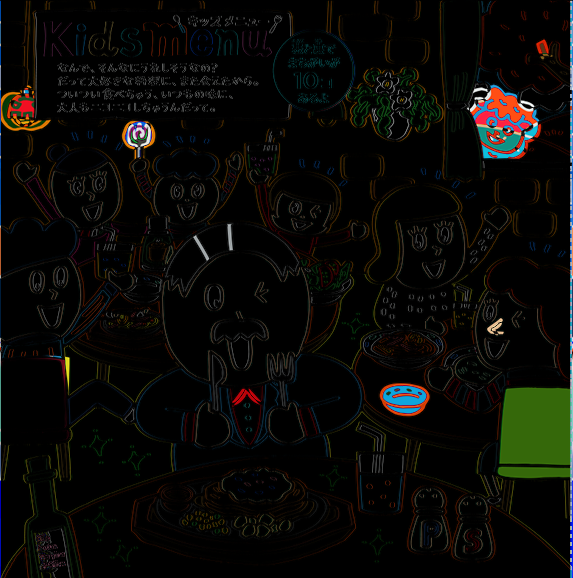
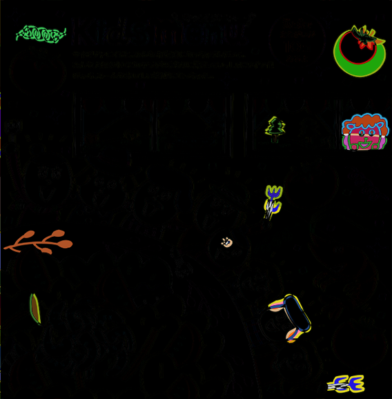
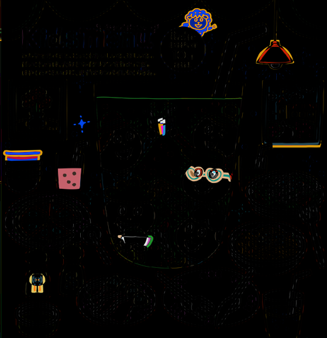
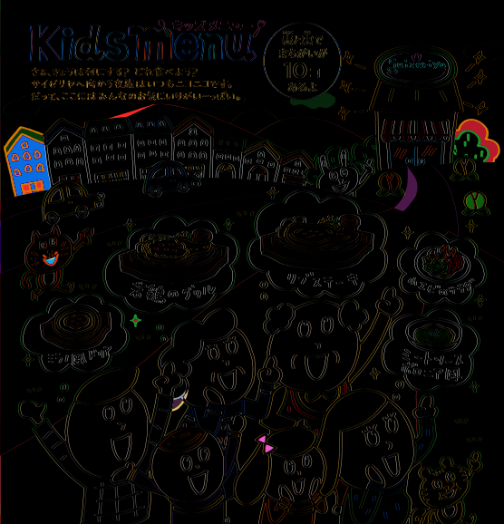

# OpenCVによるサイゼリアの間違い探し

Python + OpenCV によるサイゼリアの間違い探し

## Requirements

```
pip install opencv-python
```

## 使用した画像

https://www.saizeriya.co.jp/entertainment/

使用画像はサイゼリアの「間違い探し」をお借りしました。
それぞれの掲載日と題名は以下の通りです。

- 2018年10月「大人もニコニコしちゃうんだって。」
- 2018年6月「さぁて、今日はどれにしようかな？」
- 2018年4月「ほぉら、み〜んなおいしい笑顔になっちゃった。」
- 2018年1月「さぁ、今日は何にする？どれ食べよう？」
- 2017年10月「さぁ、今日は何にする？どれ食べよう？」












